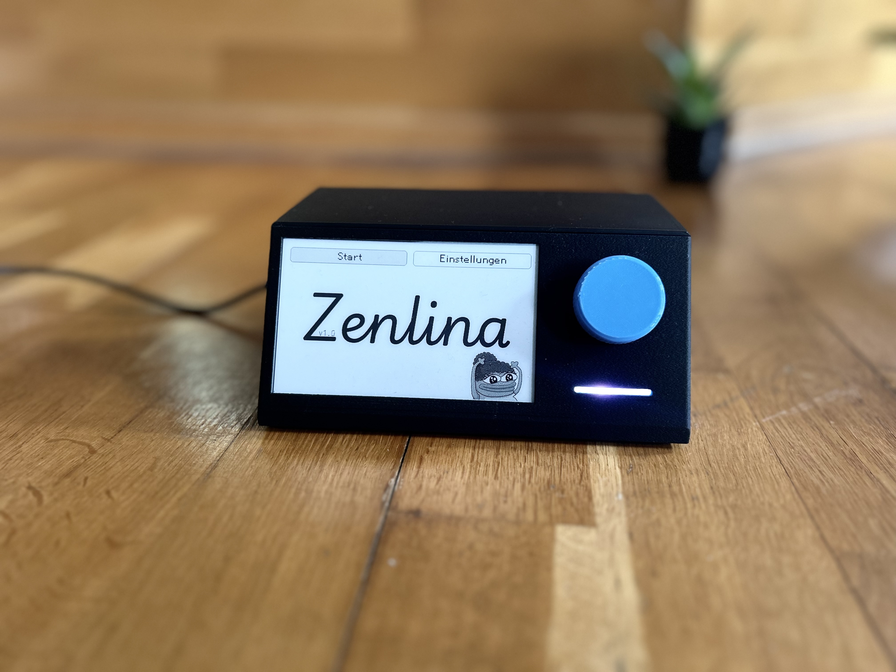
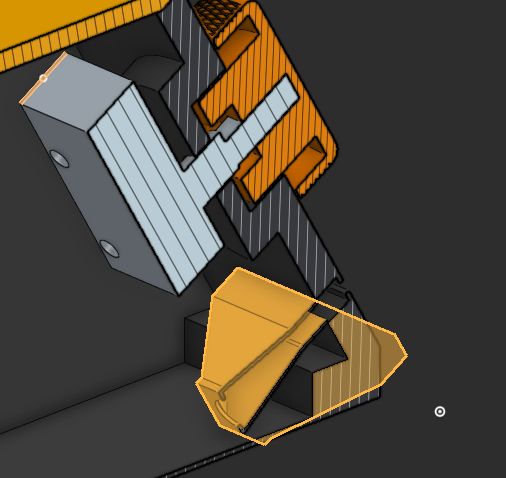
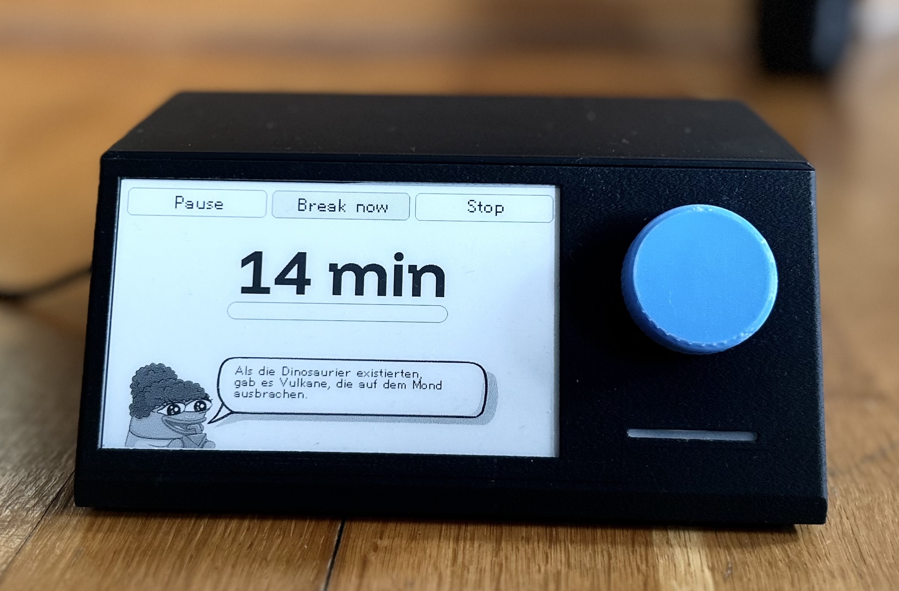
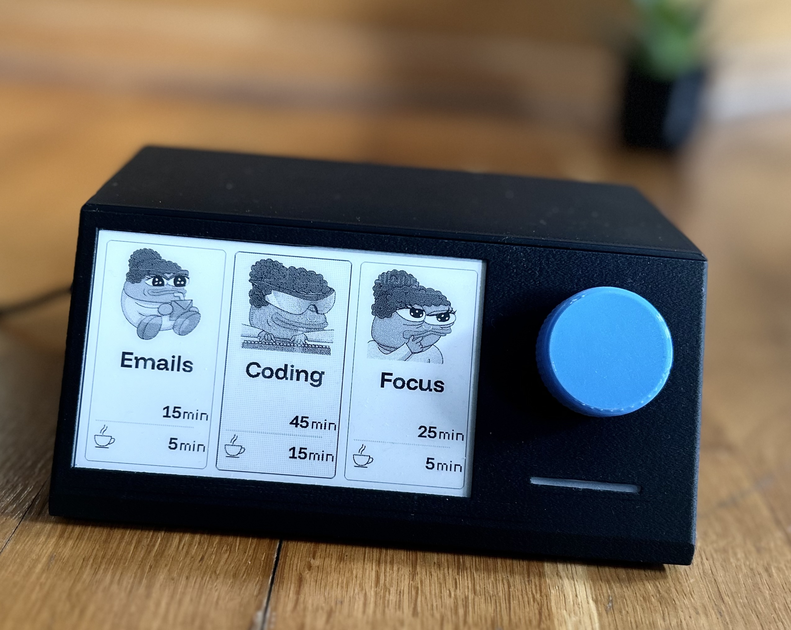
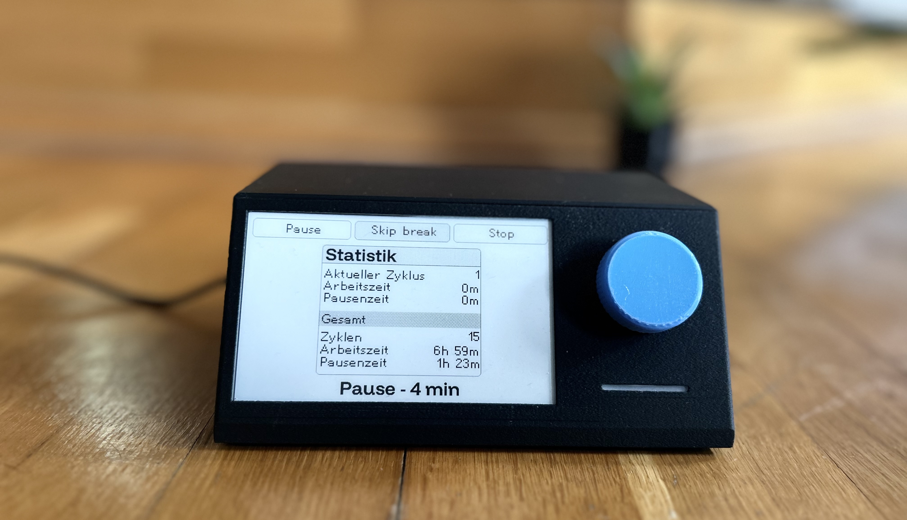

This is the repository for an ESP32 based focus timer. It uses an ePaper display and a rotary dial for input.
The code in this repository will not be ready-to-use, as some assets and fonts have been removed. However, if you really want to you should be able to adapt the code to your needs.

<p align="center">
    <a href="https://makerworld.com/de/models/1264318-pomodoro-focus-timer#profileId-1289673">
        
        <br />
        View on MakerWorld
    </a>
</p>

## Parts List

- ESP32 (I used an [AZDelivery ESP32 NodeMCU](https://www.az-delivery.de/en/products/esp32-developmentboard))
- WaveShare 4.26inch e-Paper display HAT, 800x480 ([link](https://www.waveshare.com/4.26inch-e-paper-hat.htm))
  - Other displays will work but the UI is designed for this specific resolution
- KY-040 rotary encoder with button
- A single WS2812 LED (could be replaced with a simple RGB LED)
- A USB-C connector (like [this one](https://amzn.eu/d/8UpvqWe))
  - Note: if you use a 2-wired USB-C connector, you might need to use an USB A to USB C cable to power the device (my best guess is because of the missing power delivery negotiation)
- 3d printed case ([`onshape` file](https://cad.onshape.com/documents/06055e629740267835bb7660/w/df56eb93ab74e2f4d61e5097/e/21a7853695e4900200750891?renderMode=0&uiState=67e6e3924368850ba92069f6))
- Some resistors (for the LED and a pullup resistor for the switch) and 0.1uF capacitors (to smooth out the rotary encoder signal)
- Optional: tire balancing weights and rubber feet

## Project Origin

I love trying out different productivity techniques - some say that the quest to optimize your productivity is the ultimate procrastination method, so maybe that is what drove me to this project. I also have a habit of committing time (around a month of work outside my normal job) once a year to a project that benefits someone else. Last year, I bought a 3D printer (BambuLab X1C) and wanted to put it to good use. I have previously finished an apprenticeship as an electronics
engineer before pivoting to software engineering, so I also wanted to come back to my roots and build something physical.
My friend struggles with time management throughout the day sometimes - lots of different tasks to organize, and little focus. So I thought to myself: Why not make them a focus timer? So, I set out with a few goals:

- It should be a physical device
- It should be _fun_
- It should be intuitive to use

There are some cool projects out there (arguably much cooler than this, for example the [Focus Dial by Salim Benbouziyane](https://www.youtube.com/watch?v=nZa-Vqu-_fU)), but I wanted to build something from scratch. I also
never built something with an ePaper display and thought it might be a good fit for something that is mostly idling and doesn't require a backlight.

### Why these parts?

This was my second dive back into building things with microcontrollers in a long time. I knew ESP32 well enough to feel comfortable diving back in, so that was the main choice here. I did some research before to see what kinds of displays would be supported.

#### ePaper Display

> [!TIP]
> You can find a guide on how to set up the display [here](./docs/display_wiring.md).

I needed some sort of display, or at least I _wanted_ some sort of display. One of the main motivations for this project was that it should be out of your way - until it is time to finish your current focus and move on. For me, this meant that I wanted a display without any backlight.

The display should also be large enough that you can put the whole device somewhere on your desk and still be able to read it. After ordering and playing around with a few WaveShare ePaper displays, I settled on the 4.26" variant for multiple reasons:

- Great resolution (which seems to be really hard to find for "hobbyist" displays)
- The size felt right
- The display supports partial refreshes (0.3s, no distracting "black and white flashes" while refreshing)

Initially, I really wanted to use a black/white/red display and found one that I liked, but the refresh time
was a whopping 16 seconds with no support for partial refreshes which was a dealbreaker for me.

The final bonus feature: it won't work at night. If your desk is not bright enough, you won't be able to read the display. This is a feature, not a bug. Too dark outside? Stop working already!

#### Rotary Encoder

From the start, I knew that I wanted some sort of dial as an input - it made the most sense to me. This came at the cost of some complexity when designing the menus, and you really need to make sure that you debounce the input correctly. I also added .1uF capacitors to the CLK and DT pins to help with smoothing out the signal.

#### LED

In the first few iterations, there was no plan for an LED. My genius plan of having a display without backlight came at a cost: it could be _too_ subtle when your current focus time ended. I experimented with a few different ideas:

- A buzzer: this would just make you jump. A truly horrible experience
- Speakers: I don't know why, but speakers felt _hard_. So much noise and whining with the setup I tried, but I will blame this on a skill issue
- LED: I had some WS2812 LEDs lying around and thought they might be a good fit. You can animate them with the NeoPixel library, and they are really easy to use. The additional benefit of not needing to commit many more output pins was also a big plus



The LED ended up working great, allowing me to display different states. It might be subtle, but I also added a little shroud to the case and added a diffusion layer in front of the LED to make it look nicer.

### Building the Case

The case comes in two parts: the base and a lid. One unfortunate design choice I made is that the display frame is printed as one piece as part of the base, so the top edge tends to warp a little bit during printing. Since CAD (or product design) isn't my strongest suit, there will certainly be better choices to design this for a better final look.

One thing that I wished I learned earlier is that it might not have been the best idea to put the dial in the front: because the print and electronics are so lightweight, pressing the switch on the dial will tend to just slide the whole device back. Luckily, I could solve this by adding some rubber feet and weights (the ones usually used to balance tires) to the bottom of the case. This worked out great, and I am happy with how it turned out.

### Software

The software is written in C++ and uses the Arduino framework. I used PlatformIO to manage the project (at least that is what seemed to be a popular choice, but I am not so sure about that anymore). This project relies heavily
on the GxEPD2 library for the display. I won't lie, the code in this repository is a bit of a mess - I had to get things done in time, which led to quite a bit of copy and pasting and not revisiting earlier parts of the code.
Some parts were generated by AI (Claude, for the most part) to help me finish the project in the deadline I set myself.



Since this was a project for my friend, I also wanted to include some easter eggs and fun. You would think that adding some random facts _while you are supposed to be focused_ would be a bad idea, but I think it is a fun little addition.

## Using the Device

When the device starts up, you can either change some settings or go into preset selection mode. From there, you can choose one of three presets:



The timer will then start and let you know once the time is up (by flashing the LED and displaying a message on the screen). You can keep working (not recommended, but necessary if you want to finish something) and then start the break.


During the pause, you can view some statistics. Every few iterations (4 by default), your pause will be longer to give you some time to recover.



## Development

### Prerequisites

- PlatformIO (I used the VSCode extension)
- Python 3.13+ for asset (re)generation

### Generating Assets

In order to prepare images, icons, and fonts, you will need to run the `generate_assets.py` script. This script will take care of resizing images, converting them to the correct format, and generating the necessary C++ code to include them in the project.

```bash
# install dependencies with uv or a different package manager
uv sync

uv run scripts/generate_assets.py
```

### Customizing Presets

The presets are defined in `src/main.cpp`:

```cpp
  timer.addPreset(iconProvider->getPresetIcon("Emails"), iconProvider->getTimerRunningBackgroundImage(), "Emails", 15 * MINUTE, 5 * MINUTE, 15 * MINUTE);
  timer.addPreset(iconProvider->getPresetIcon("Coding"), iconProvider->getTimerRunningBackgroundImage(), "Coding", 45 * MINUTE, 15 * MINUTE, 30 * MINUTE, 2);
  timer.addPreset(iconProvider->getPresetIcon("Focus"), iconProvider->getTimerRunningBackgroundImage(), "Focus", 25 * MINUTE, 5 * MINUTE, 20 * MINUTE);
```

If you want to customize this, I would start there and keep looking for references to these presets.

## Pin Mapping

#### Rotary Encoder (KY-040)

| PIN | #   |
| --- | --- |
| CLK | 32  |
| DT  | 21  |
| SW  | 14  |

#### ePaper Display (GxEPD2_426_GDEQ0426T82, WaveShare 4.26" b/w)

| PIN  | #   |
| ---- | --- |
| BUSY | 4   |
| RST  | 16  |
| DC   | 17  |
| CS   | 5   |
| CLK  | 18  |
| DIN  | 23  |

#### LED (WS2812)

| PIN | #   |
| --- | --- |
| DIN | 25  |
